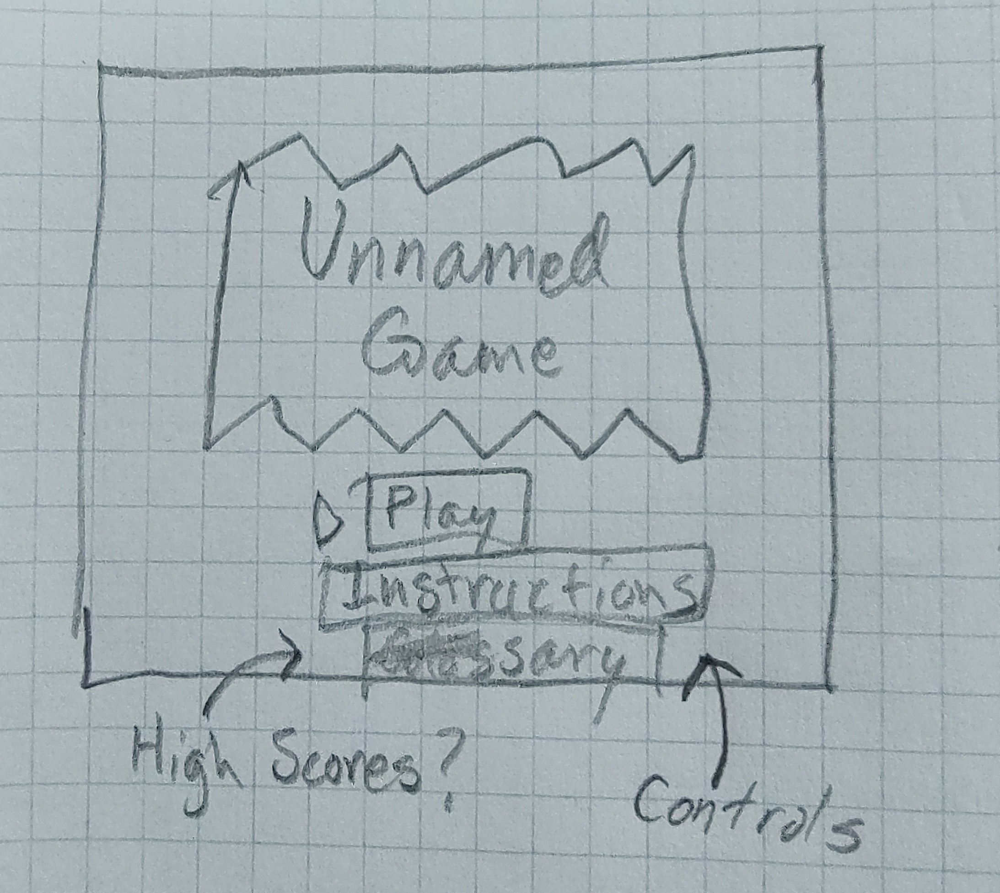
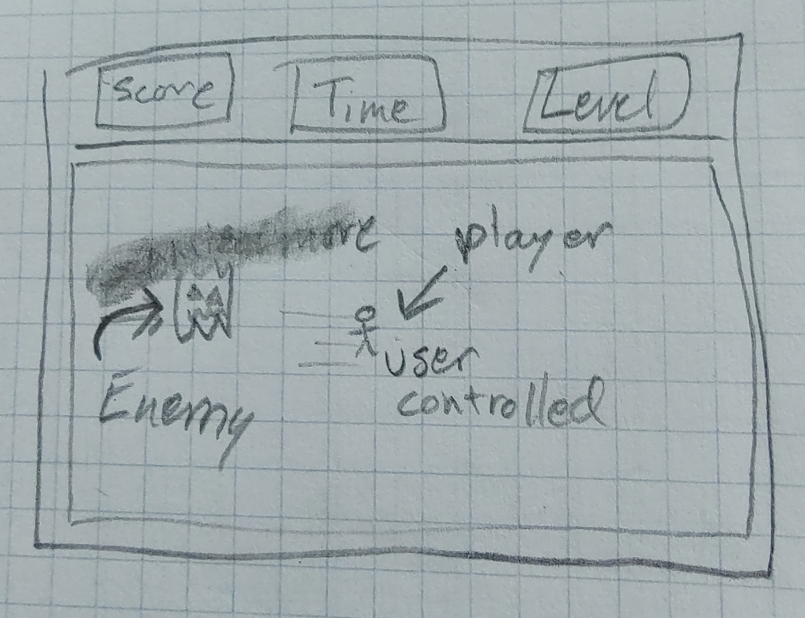
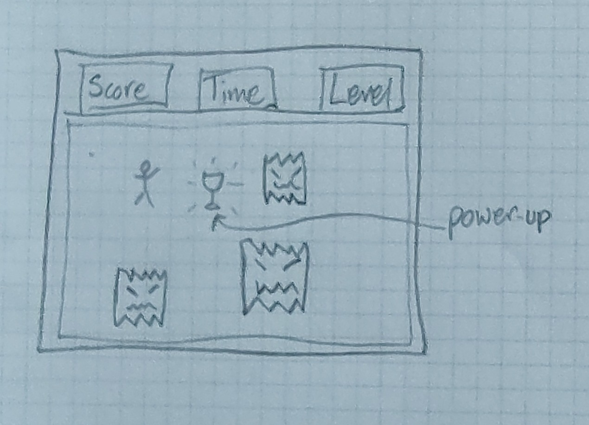

# Unnamed Survival Game

## Overview

This game was inspired by an attempt to not agonize over the perfect project idea. The user controls a lone character trying to survive as more and more hazards enter the beautiful plain box that is its home. These attempts will inevitably prove fruitless, but think of the high scores to be achieved!

### Technologies used:
-HTML5
-CSS
-Javascript
-Canvas

## User Stories
As a user I want the ability to:
-Start a new game
-View past high scores
-View past best times
-View instructions
-Change keybinds(maybe)
-See my character represented on the screen
-Move my character around the screen using the keyboard
-See enemies on the screen
-See enemies move on the screen
-See boosts appear on the screen
-Move my character to pick up boosts
-See the current (difficulty) level
-See the current score displayed
-See the time elapsed displayed

## Wireframes

Title screen displaying title, giving the option to start, view high scores, and instructions. Maybe also change controls

Shot of the game. Enemies move randomly around the screen as the player moves using the keyboard, trying to avoid being touched. Their score is constantly accumulating as the time runs.

The player can pick up boosts which give abilities (temporary invulnerability, timestop, destroy enemies, etc.) or just boost the score. At later levels, more enemies appear, some with different sizes, speeds or movement patterns.

When the player collides with an enemy the game is over. They can save their score with a set of initials.

## Classes, basic development ideas
-There will be a player class and several different enemy classes.
-The different enemy classes will have different movement patterns
-Initial enemy movement will have a set speed and the direction will be determined by a math.random function within a setInterval function
-Later enemies (same class) will have higher speeds and/or larger sizes
-Advanced enemies will have their movement optimized to move towards the player, albeit at a slow speed. This will be added only if the initial stages have been perfected.

